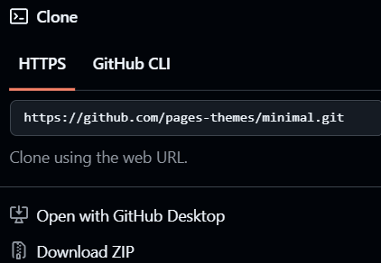
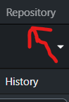
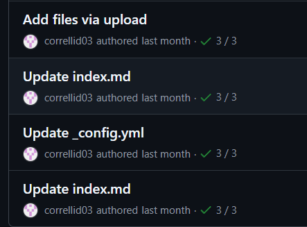
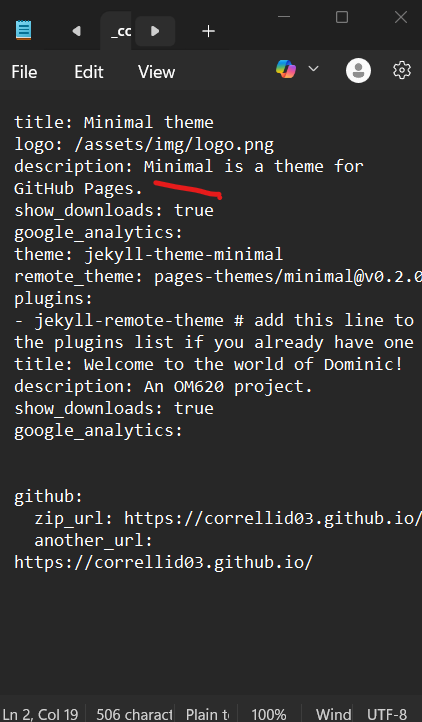
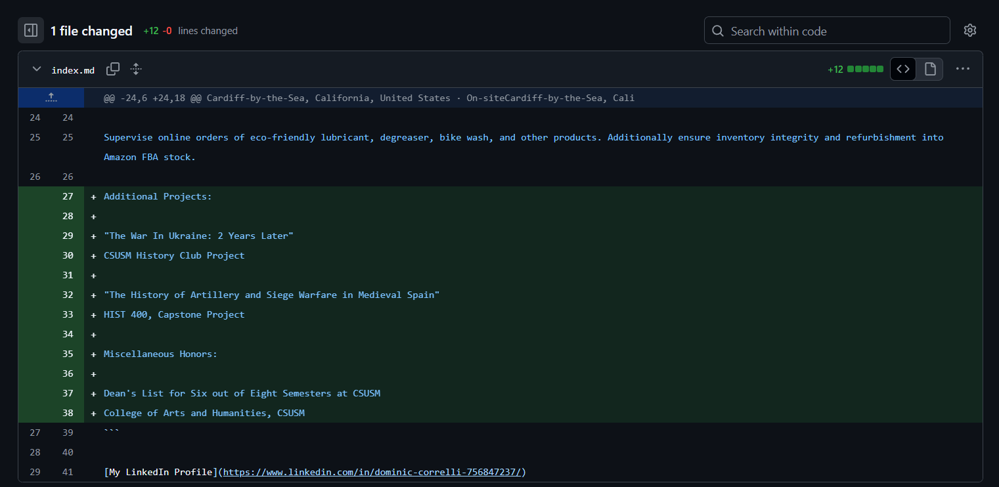
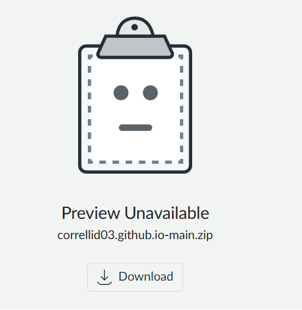

# Howdy, you have reached the explanation for how I previously got this website created. With my philosophy of "figuring it out as I go", some content is limited in terms of documentation but that will soon change.

## Step 1
### Downloading minimal was not hard with the ZIP being publically available, though it did make me realize I did not have WinRar on this laptop and thus I promptly went to go install that as well.

## Step 2
### Commiting it seemed simple enough, but I was an idiot and saved ny changes to the wrong directory. It took me about 20 minutes to realize what I did wrong, but it was simple enough after that.

## Step 3
### This process was simple to observe after that through Github Desktop.

## Step 4
### Hooray! I can see the changes through a history/commitment date being observable.

# Moving beyond getting the minimal demo

## Using YAML files
### Simple enough to edit YAML files, I personally just did it in Notepad.

## Replacing the stock photo
### Again, easy enough to do. Simply put in a file and set the name to 'logo.png',

## Rewriting index.md
### This seemed easy enough, but strange formatting definitely took some time for me to be used to.

## Making a final commit
### As before when I first setup the minimal demo template, this was easy enough to observe on the Github website.

## Final submissionn
### Through my recent installation of WinRar, I used it to compress my files into a ZIP and uploaded it to Canvas.

